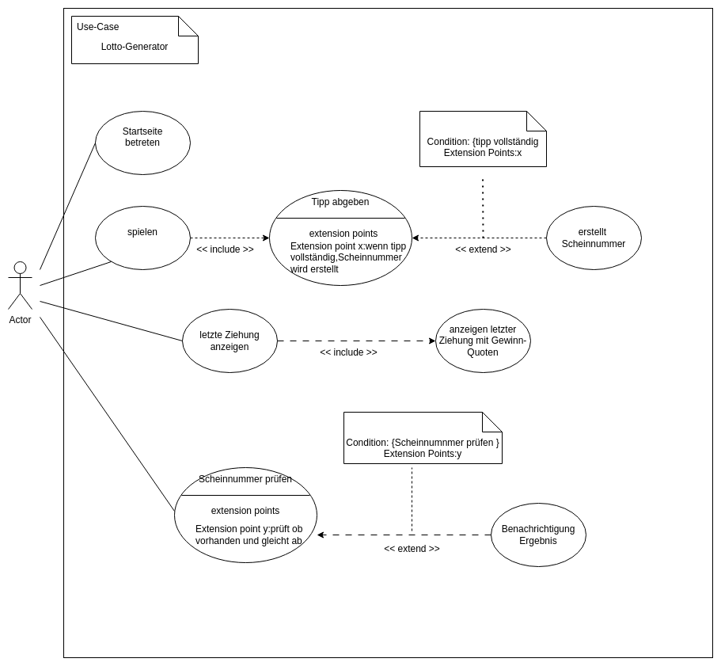
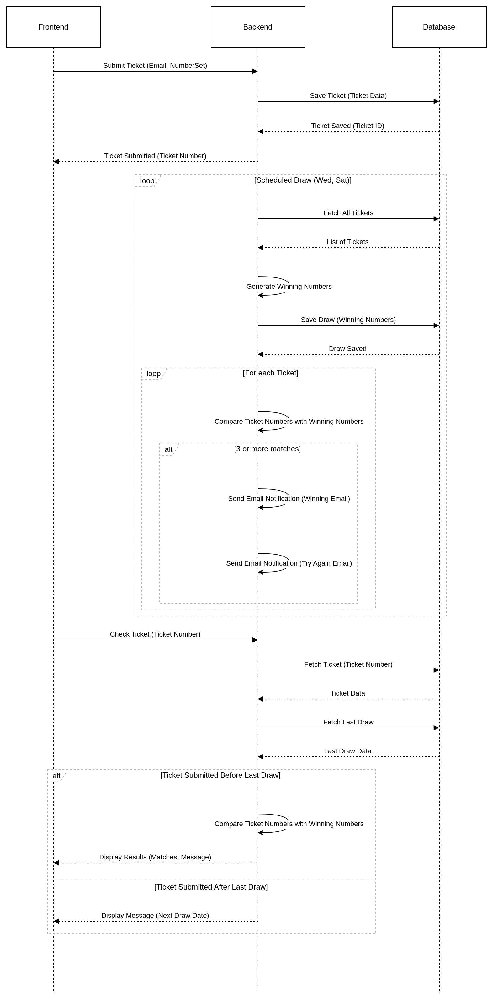
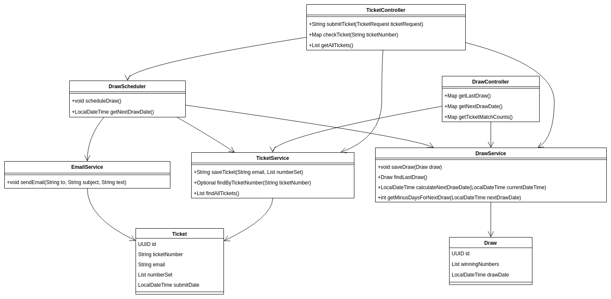
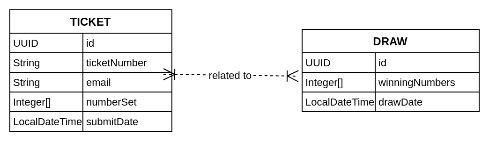
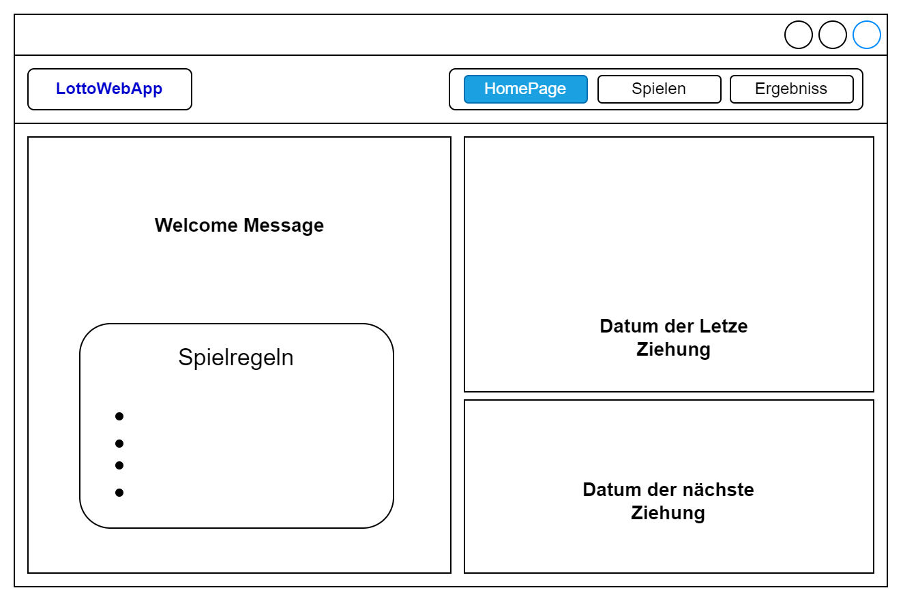
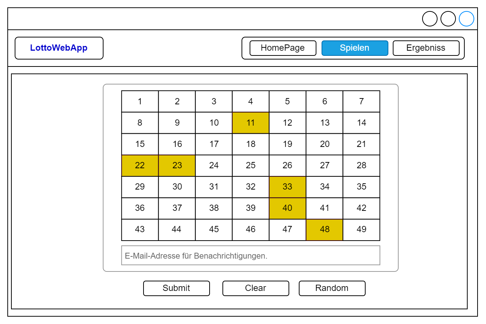
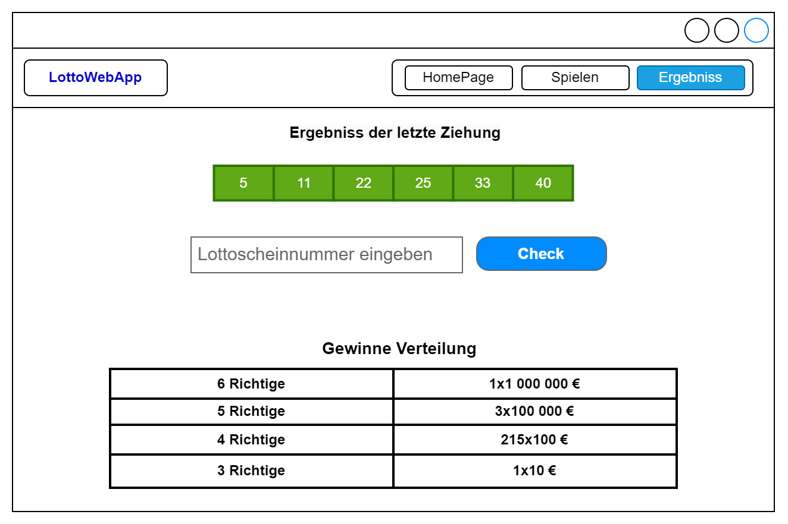

Lotto Simulator Projekt Dokumentation
================================================

Inhaltsverzeichnis
-------------------------------

- [1- Einleitung](#einleitung)
- [2- Analyse](#analyse)
- [3- Konzeption](#konzeption)
- [4- Realisierung](#realisierung)
- [5- Überprüfung](#ueberpruefung)
- [6- Wartung](#wartung)

1. Einleitung
--------------------------

### 1.1 Projektübersicht

Der Lotto Simulator ist eine Webanwendung, die es Benutzern ermöglicht,
Lottoscheine online einreichen, die Ergebnisse der Ziehungen überprüfen
und automatisierte Benachrichtigungen erhalten. Das System führt zweimal
wöchentlich Ziehungen durch, wobei die vom Benutzer eingereichten Zahlen
mit den gezogenen Gewinnzahlen verglichen werden.

Die Anwendung besteht aus mehreren Kernkomponenten:

-   Frontend: Eine intuitive und leicht navigierbare Benutzeroberfläche,
    die es den Benutzern ermöglicht, Lottoscheine einzureichen und ihre
    Gewinnchancen zu überprüfen.
-   Backend: Ein robustes Backend-System, das die Verarbeitung der
    eingegebenen Daten, die Durchführung der Ziehungen übernimmt.
-   Datenbank: Eine zuverlässige Datenbank zur Speicherung aller
    relevanten Informationen, einschließlich Lottoscheinen und
    Ziehungsergebnissen.
-   Benachrichtigungssystem: Ein automatisiertes System zur
    Benachrichtigung der Benutzer über die Ergebnisse ihrer
    eingereichten Lottoscheine.

### 1.2 Ziele

-   Bereitstellung einer benutzerfreundlichen Oberfläche zur Eingabe von
    Lottoscheinen.
-   Automatisierung von Ziehungen zweimal pro Woche.
-   Benachrichtigung der Benutzer über deren eingereicht Lottoscheine
    wenn die Ziehung stattgefunden hat.
-   Bereitstellung einer Möglichkeit zur Überprüfung der Lottoscheine.

### 1.3 Umfang

Der Umfang dieses Projekts umfasst die vollständige Entwicklung und
Implementierung der Webanwendung einschließlich der folgenden
Komponenten:

-   Frontend-Entwicklung: Erstellung einer benutzerfreundlichen
    Weboberfläche mit modernen Web-Technologien wie HTML, CSS und
    JavaScript.

-   Backend-Entwicklung:

    -   Implementierung eines robusten Backend-Systems mit Spring Boot
        Framework von Java.
    -   Entwicklung von APIs zur Kommunikation zwischen Frontend und
        Backend.

-   Datenbankdesign:

    -   Erstellung einer skalierbaren und effizienten Datenbankstruktur
        zur Speicherung aller relevanten Daten.
    -   Verwendung von Datenbankmanagementsystem: PostgreSQL.

-   Benachrichtigungssystem: Integration eines
    E-Mail-Benachrichtigungssystems zur automatischen Benachrichtigung
    der Benutzer.

-   Testing und Qualitätssicherung: Durchführung umfangreicher Tests zur
    Sicherstellung der Funktionalität und Zuverlässigkeit der
    Webanwendung.

-   Deployment und Wartung:

    -   Bereitstellung der Webanwendung auf einer geeigneten
        Hosting-Plattform.
    -   Regelmäßige Wartung und Updates zur Sicherstellung der
        kontinuierlichen Funktionalität und Sicherheit der Anwendung.

2. Analyse
-----------------------

### 2.1 Projektplanung

### 2.1.1 Zeitplanung

Für das Projekt standen insgesamt 120 Stunden zur Verfügung. Diese
wurden über einen Zeitraum vom 15.05.2024 - 05.06.2024 aufgeteilt. Die
reguläre Tagesarbeitszeit beträgt von Montag bis Freitag je 8 Stunden.
Die Einteilung in die Phasen können in folgenden entnommen werden.

-   Analysephase: 16 Stunden
-   Konzeption: 24 Stunden
-   Realisierung: 56 Stunden
-   Validierung: 8 Stunden
-   Dokumentation: 16 Stunden

### 2.1.2 Ressourcenplanung

Für die Durchführung dieses Projekts wurde ein Arbeitsplatz mit einem Laptop
bereitgestellt. Die Arbeit wurde auf einer VM-Ware Virtual Maschine mit Linux
Ubuntu Betriebssystem durchgeführt. Zur Entwicklung des Programmcodes wird
die kostenlose Software IntelliJ IDEA Community von der Firma JetBrains
verwendet. Die Interaktion mit der PostgreSQL-Datenbank erfolgte
mithilfe der Software pgAdmin4.

UML-Diagramme und Storyboards werden mit der Software Draw.io
erstellt. Mit diesem Tool können unter anderem Grafiken, Netzdiagramme
und andere Diagrammarten erstellt werden. Für die Erstellung dieser
Dokumentation wurde LibreOffice Writer verwendet.

### 2.2 Anforderungsanalyse

Der Lotto Simulator bietet Benutzern die Möglichkeit, Lottoscheine mit sechs Zahlen zwischen 1 und 49 einzureichen. Sobald ein Lottoschein eingereicht wird, speichert das System diesen mit einer eindeutigen Ticketnummer, die zur Identifikation und Überprüfung dient. Die Ziehungen erfolgen automatisch zweimal wöchentlich, jeweils mittwochs und samstags. Bei jeder Ziehung werden die vom Benutzer eingereichten Zahlen mit den gezogenen Gewinnzahlen verglichen. Wenn die Zahlen übereinstimmen, erhalten die Benutzer eine Benachrichtigung per E-Mail. Darüber hinaus können Benutzer ihre Lottoscheine jederzeit anhand der Ticketnummer im System überprüfen. Die folgende Abbildung zeigt das Use Case Diagramm, das die Interaktionen zwischen den Benutzern und dem System darstellt. 

Abbildung 1: Use-Case Diagramm

Im Anschluss wird ein Sequenzdiagramm dargestellt, das den Ablauf einer typischen Benachrichtigung bei einer Übereinstimmung der Zahlen illustriert:

Abbildung 2: Sequenzdiagramm

3. Konzeption
--------------------------

### 3.1 Systemarchitektur

Das Architekturdesign für das Projekt sollte eine komponentenbasierte
Struktur aufweisen, die in separate Module unterteilt ist, um die
Wartbarkeit und Skalierbarkeit zu verbessern. Services sollten genutzt
werden, um gemeinsam genutzte Funktionalität und Datenzugriff zu
kapseln, Eine gute Testbarkeit durch die Trennung von Logik und
Darstellung in Komponenten und Services ist ebenfalls wichtig. Durch
Berücksichtigung dieser Prinzipien kann ein robustes, skalierbares und
hochwertiges Projekt entwickelt werden, das den Anforderungen der
Benutzer gerecht wird.

-   Frontend: Entwickelt mit Thymeleaf und Bootstrap für die
    Benutzeroberfläche.
-   Backend: Implementiert mit Java Spring Boot.
-   Datenbank: PostgreSQL zur Speicherung von Benutzerdaten und
    Ziehungsergebnissen.
-   E-Mail-Service: JavaMailSender zur Versendung von
    Benachrichtigungen.
-   Scheduler: Spring Scheduler zur automatischen Durchführung der
    Ziehungen.

Das Klassendiagramm zeigt, wie die verschiedenen Komponenten des Systems
miteinander interagieren und welche Attribute und Methoden jede Klasse
enthält. Zu den zentralen Klassen gehören Ticket, Draw, User,
TicketController, DrawController, TicketService, DrawService,
EmailService, TicketRepository und DrawRepository. Die Ticket-Klasse
repräsentiert einen Lottoschein mit Attributen wie Ticketnummer,
ausgewählten Zahlen und Einreichungsdatum, während die Draw-Klasse die
Ziehung mit Gewinnzahlen und Ziehungsdatum darstellt. Die User-Klasse
enthält Benutzerdetails wie Benutzer-ID und E-Mail. Die
Controller-Klassen (TicketController und DrawController) verwalten die
Benutzeranfragen und interagieren mit den Service-Klassen
(TicketService, DrawService, EmailService), die die Geschäftslogik
implementieren. Die Repository-Klassen (TicketRepository,
DrawRepository) kümmern sich um die Datenbankoperationen. Dieses
Diagramm hilft dabei, die Struktur und Interaktionen im System klar zu
definieren und dient als Leitfaden für die Entwicklung und Wartung der
Anwendung.

Abbildung 3: Klassendiagramm

### 3.2 Datenmodellierung

Das Datenmodell des Lotto Simulators wird in einem
Entity-Relationship-Model (ERM) visualisiert, das die Struktur und die
Beziehungen der gespeicherten Daten darstellt. Die beiden Hauptentitäten
in diesem Modell sind Ticket und Draw. Diese Entitäten speichern alle
relevanten Informationen, die zur Verwaltung der Lottoscheine und der
Ziehungen erforderlich sind. In der folgenden Abbildung werden die
Entitätstypen und ihre Attribute sowie ihre Beziehungen gezeigt.

Abbildung 4: ER-Diagramm

### 3.3 UI-Design

Startseite: Die Startseite des Lotto Simulators zeigt eine freundliche
Willkommensnachricht. Weiterhin werden die Spielregeln klar und prägnant
dargestellt, damit sowohl neue als auch erfahrene Benutzer sofort
verstehen, wie sie teilnehmen können: Sie erfahren, wie sie Lottoscheine
mit sechs Zahlen zwischen 1 und 49 einreichen, den Zeitplan der
wöchentlichen Ziehungen (mittwochs und samstags) und die Methode zur
Ermittlung der Gewinner. Zusätzlich zeigt die Startseite die letzten
Gewinnzahlen an, damit Benutzer schnell die Ergebnisse der letzten
Ziehung einsehen können. Diese Informationen werden prominent platziert,
um ihre Sichtbarkeit zu maximieren. Zudem wird das Datum der nächsten
Ziehung angezeigt, möglicherweise ergänzt durch einen Countdown-Timer,
der die verbleibende Zeit bis zur nächsten Ziehung anzeigt. Diese
Kombination von Informationen sorgt dafür, dass die Benutzer stets gut
informiert und zum rechtzeitigen Einreichen ihrer Lottoscheine motiviert
sind.

Abbildung 5: Startseite

Lottoschein einreichen: Diese Seite bietet eine benutzerfreundliche
Oberfläche, die es den Benutzern ermöglicht, ihre gewünschten Zahlen
einfach auszuwählen. Das zentrale Element ist ein Zahlenauswahlfeld, in
dem die Benutzer sechs Zahlen zwischen 1 und 49 auswählen können.
Zusätzlich gibt es ein Eingabefeld für die E-Mail-Adresse, in das die
Benutzer ihre E-Mail eingeben können, um sicherzustellen, dass sie
Benachrichtigungen über die Ergebnisse erhalten können. Zwei prominente
Schaltflächen bieten die Hauptaktionen: eine Schaltfläche zum Einreichen
des Lottoscheins, die die Auswahl bestätigt und den Lottoschein zur
nächsten Ziehung speichert, und eine Schaltfläche zum Löschen der
Auswahl, die es den Benutzern ermöglicht, ihre Auswahl zurückzusetzen
und neu zu beginnen, falls sie ihre Entscheidung ändern.

Abbildung 6: Lottospielen Seite

Lottoschein überprüfen: Diese Seite ist darauf ausgelegt, den Benutzern
eine schnelle und einfache Möglichkeit zu bieten, ihre Ergebnisse nach
einer Ziehung zu überprüfen. Im Mittelpunkt steht ein Eingabefeld für
die Ticketnummer, in das Benutzer die eindeutige Nummer ihres
Lottoscheins eingeben können. Neben dem Eingabefeld befindet sich eine
prominente Schaltfläche zur Überprüfung, die den Überprüfungsprozess
startet, sobald sie geklickt wird. Diese Schaltfläche ist auffällig
gestaltet, um den Benutzern klar zu signalisieren, dass sie hier ihre
Ergebnisse einsehen können. Nach dem Klick auf die
Überprüfungsschaltfläche verarbeitet das System die Eingabe und
vergleicht die Ticketnummer mit den gespeicherten Daten der letzten
Ziehung. Die Ergebnisse werden dann auf derselben Seite angezeigt, wobei
sowohl die Gewinnzahlen als auch der Status des eingereichten Tickets
(z.B. Gewinn oder kein Gewinn) dargestellt werden.

Abbildung 7: CheckTicket Seite

4. Realisierung
----------------------------

### 4.1 Frontend-Entwicklung

Die Frontend-Entwicklung des Lotto Webapp Simulators konzentriert sich
auf die Erstellung einer benutzerfreundlichen und ansprechenden
Oberfläche, die den Benutzern eine intuitive Interaktion mit der
Anwendung ermöglicht.

-   **Thymeleaf Templates:**

    -   index.html: Dies ist die Hauptseite der Anwendung, die
        grundlegende Informationen über den Lotto Simulator bereitstellt
        und Benutzern den Zugang zu den verschiedenen Funktionen der
        Anwendung ermöglicht.
    -   playLotto.html: Diese Seite erlaubt es den Benutzern, ihre
        Lottoscheine einzureichen. Benutzer können sechs Zahlen zwischen
        1 und 49 auswählen, ihre E-Mail eingeben, wenn sie möchten, und
        diese zur Teilnahme an der nächsten Ziehung absenden.
    -   checkTicket.html: Auf dieser Seite können Benutzer ihre
        eingereichten Lottoscheine überprüfen, indem sie die eindeutige
        Ticketnummer eingeben, um die Ergebnisse der Ziehungen zu sehen.

-   **CSS:**

    -   Das Design der Anwendung wird durch Bootstrap unterstützt, um
        ein modernes und responsives Layout zu gewährleisten. Zusätzlich
        werden benutzerdefinierte CSS-Dateien verwendet, um spezifische
        Designanforderungen zu erfüllen.

-   **JavaScript:**

    -   Zahlenauswahl: JavaScript wird verwendet, um die Logik für die
        Auswahl der Zahlen zu implementieren und sicherzustellen, dass die
        Lotto-Regeln erfüllt sind.
    -   Lottoscheinübermittlung: Die Logik für die Übermittlung der
        Lottozahlen wird in JavaScript implementiert, um eine
        reibungslose und benutzerfreundliche Erfahrung zu gewährleisten.
    -   Ergebnisanzeige: JavaScript wird verwendet, um die Ergebnisse
        der Ziehungen dynamisch anzuzeigen, sobald der Benutzer seine
        Ticketnummer zur Überprüfung eingibt.

### 4.2 Backend-Entwicklung

Die Backend-Entwicklung konzentriert sich auf die Implementierung der
Kernlogik der Anwendung, die Verarbeitung der Benutzereingaben, die
Durchführung der Ziehungen und die Verwaltung der Datenbankoperationen.

-   **Controller:**

    -   TicketController: Dieser Controller ist verantwortlich für die
        Verarbeitung der Benutzereingaben beim Einreichen von
        Lottoscheinen und beim Überprüfen der Ergebnisse. Er nimmt die
        Anfragen entgegen, validiert sie und delegiert die Verarbeitung
        an die entsprechenden Services.
    -   DrawController: Dieser Controller kümmert sich um die Verwaltung
        der Ziehungen. Er wird hauptsächlich vom Scheduler verwendet, um
        die Ziehungen zu starten und die Ergebnisse zu speichern.

-   **Services:**

    -   TicketService: Dieser Service verarbeitet die eingereichten
        Lottoscheine, speichert sie in der Datenbank und stellt Methoden
        zur Überprüfung der Ticketnummern bereit.
    -   DrawService: Dieser Service führt die Ziehungen durch, generiert
        die zufälligen Gewinnzahlen, speichert die Ziehungsergebnisse
        und vergleicht die eingereichten Lottoscheine mit den
        Gewinnzahlen.
    -   EmailService: Dieser Service kümmert sich um das Senden von
        Benachrichtigungen per E-Mail. Er wird verwendet, um Benutzer
        über die Ergebnisse der Ziehungen zu informieren, insbesondere
        wenn ihre Zahlen mit den Gewinnzahlen übereinstimmen.

-   **Entities:**

    -   Ticket: Diese Entity repräsentiert einen eingereichten
        Lottoschein mit den entsprechenden Attributen wie Ticketnummer,
        ausgewählten Zahlen und dem Benutzer, der das Ticket eingereicht
        hat.
    -   Draw: Diese Entity repräsentiert eine Ziehung mit den Attributen
        wie Ziehungsdatum, den gezogenen Gewinnzahlen und einer Liste
        der gewonnenen Tickets.

-   **Repositories:**

    -   TicketRepository: Dieses Repository bietet Methoden zum
        Speichern, Abrufen und Verwalten der Lottoscheine in der
        Datenbank.
    -   DrawRepository: Dieses Repository bietet Methoden zum Speichern,
        Abrufen und Verwalten der Ziehungsergebnisse in der Datenbank.

-   **Scheduler:**

    -   Ziehungsscheduler: Der Scheduler wird mit Spring Scheduler
        implementiert und ist für die automatische Durchführung der
        Ziehungen an den festgelegten Tagen (mittwochs und samstags)
        verantwortlich. Er startet die Ziehungen, führt die
        Gewinnzahlen-Generierung durch und löst die Benachrichtigungen
        aus.

### 4.3 Datenbank-Implementierung

Die Datenbank-Implementierung stellt sicher, dass alle relevanten Daten
sicher und effizient gespeichert und verwaltet werden.

Die PostgreSQL-Datenbank wird konfiguriert und eingerichtet, um die
Benutzer- und Ziehungsdaten zu speichern. Die Datenbankkonfiguration
umfasst das Einrichten von Verbindungsparametern, Sicherheitsrichtlinien
und der notwendigen Datenbankstruktur.

-   **Dateninitialisierung:**

    -   Zur Überprüfung der Funktionalität werden Testdaten in die
        Datenbank eingefügt. Diese Testdaten umfassen Beispielbenutzer,
        Lottoscheine und Ziehungsergebnisse. Dadurch kann die Anwendung
        in einer kontrollierten Umgebung getestet werden, um
        sicherzustellen, dass alle Funktionen korrekt arbeiten.

5. Überprüfung
---------------------------

### 5.1 Teststrategie

-   Integrationstests: Testen der Integration der verschiedenen
    Komponenten.
-   Systemtests: Testen des gesamten Systems auf Funktionalität,
    Leistung und Sicherheit.
-   Benutzerakzeptanztests (UAT): Durchführung von Tests mit
    Endbenutzern zur Sicherstellung, dass das System deren Anforderungen
    und Erwartungen erfüllt.

### 5.2 Testfälle

-   Lottoschein einreichen:

    -   Testen der Einreichung eines gültigen Scheins.
    -   Testen der Einreichung eines Scheins mit ungültigen Zahlen.
    -   Testen der Einreichung eines Scheins ohne E-Mail.

-   Lottoschein überprüfen:

    -   Testen der Überprüfung eines Scheins vor der Ziehung.
    -   Testen der Überprüfung eines Scheins nach der Ziehung.
    -   Testen der Überprüfung eines Scheins mit ungültiger
        Ticketnummer.

-   Ziehung planen:

    -   Testen der automatischen Planung der Ziehung am Mittwoch und
        Samstag.
    -   Testen der manuellen Planung der Ziehung zu Testzwecken.

-   Benachrichtigung:

    -   Testen der E-Mail-Benachrichtigungen für Gewinnscheine.
    -   Testen der E-Mail-Benachrichtigungen für Nicht-Gewinnscheine.

6. Wartung
-----------------------

### 6.1 Fehlerbehebungen

Behebung aller identifizierten Fehler und Probleme.

### 6.2 Performance-Tuning

Optimierung der Anwendung für bessere Leistung.

### 6.3 Feature-Erweiterungen

Hinzufügen neuer Funktionen basierend auf Benutzerfeedback.

### 6.4 Sicherheitsupdates

Implementierung von Sicherheits-Patches und Updates.

### 6.5 Regelmäßige Backups

Sicherstellung regelmäßiger Backups der Datenbank zur Vermeidung von Datenverlust.

Diese Dokumentation beschreibt detailliert alle Phasen des
Wasserfallmodells für das Lotto Simulator Projekt. Jede Phase enthält
spezifische Aktivitäten und Ergebnisse, die zur erfolgreichen Umsetzung
des Projekts beitragen. Die strukturierte Herangehensweise stellt
sicher, dass alle Anforderungen erfasst, das System ordnungsgemäß
entworfen und implementiert wird und schließlich den Benutzern in einer
gut dokumentierten und wartbaren Form zur Verfügung steht.

Durch die umfassende Dokumentation und Wartung wird sichergestellt, dass
das Lotto Simulator Projekt nicht nur erfolgreich bereitgestellt,
sondern auch langfristig unterstützt und weiterentwickelt werden kann.

